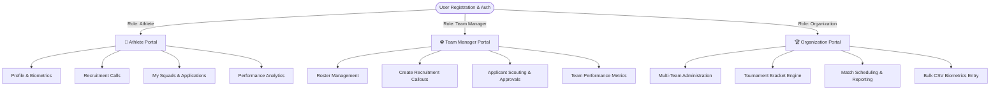

# 🏆 ATHLETIX — Next-Gen Multi-Tenant Sports & Athlete Management Ecosystem

[](https://athlete-management-beige.vercel.app)
[](https://athlete-management-b0da.onrender.com)
[](https://react.dev)
[](https://tailwindcss.com)
[](https://ant.design)
[](https://expressjs.com)
[](https://mongodb.com)

**ATHLETIX** is a comprehensive, enterprise-grade sports management platform designed to connect **Athletes**, **Team Managers**, and **Sports Organizations** in a unified, multi-tenant digital ecosystem. 

From scouting talent and publishing recruitment drives to managing tournament brackets, entering bulk player biometrics, and analyzing longitudinal performance metrics, ATHLETIX streamlines sports administration.

---

## 🌟 Key Platform Portals & Features



### 🏃 1. Athlete Portal
* **Digital Athlete Passport**: Manage personal profile, position, sport specialization, height, weight, and biometrics.
* **Scouting & Recruitment Discovery**: Filter open team trials by sport, category, age group, and city location.
* **One-Click Application System**: Apply to scouting calls with real-time status tracking (*Pending*, *Accepted*, *Rejected*).
* **Personal Performance Analytics**: Interactive metrics tracking career statistics, progress breakdowns, and game logs.

### ⚽ 2. Team Manager Portal
* **Squad Roster Management**: Manage active team members, player roles, and squad availability.
* **Recruitment Campaign Publisher**: Create and launch scouting drives with custom age limits, position requirements, and spot quotas.
* **Applicant Review System**: Inspect candidate profiles and accept or reject applications with automatic roster additions.
* **Team Analytics**: Track team-wide performance trends across match fixtures.

### 🏆 3. Organization Portal
* **Multi-Tenant Administration**: Oversee multiple squads, sports clubs, and organizational branches.
* **Tournament Engine**: Create tournaments, generate fixture schedules, and record match report cards.
* **Bulk Performance Data Entry**: Ingest bulk player metrics via CSV file uploads or single-entry scorecards.
* **Cross-Team Analytics**: High-level statistical overviews of player growth, tournament leaderboards, and match logs.

---

## 🎨 Design System & Theme Engine

ATHLETIX features a bespoke design system built on modern visual design principles:

* **Perpetual Synchronized Theme**: Powered by `ThemeContext`, seamlessly toggle between **Nordic Obsidian Dark** (`#0B0E14`) and **Clean Studio Light** (`#F8F9FA`) across every component in real-time.
* **High-Contrast Typography**: Custom font pairing (`Geist` for body text, `Geist Mono` for statistical data).
* **Hardware-Accelerated Micro-Motion**: Smooth Framer Motion transitions and micro-animations for interactive cards, sidebars, and modals.
* **Fully Responsive Layouts**: Tailored for mobile, tablet, and widescreen desktop experiences.

---

## 🛠️ Technology Stack

### **Frontend**
* **Framework**: [React 19](https://react.dev) + [Vite 8](https://vitejs.dev)
* **Styling**: [TailwindCSS v4](https://tailwindcss.com) + [Ant Design v6](https://ant.design)
* **State Management**: [Redux Toolkit](https://redux-toolkit.js.org) + Context API (`ThemeContext`)
* **Routing**: [React Router v7](https://reactrouter.com)
* **Animations & Icons**: [Framer Motion](https://www.framer.com/motion/), [Lucide React](https://lucide.dev), [@ant-design/icons](https://ant.design/components/icon)
* **Deployment**: [Vercel](https://vercel.com) (SPA Client-Side Routing configured via `vercel.json`)

### **Backend**
* **Runtime**: [Node.js 24](https://nodejs.org) (ES Modules)
* **Framework**: [Express v5](https://expressjs.com)
* **Database**: [MongoDB](https://www.mongodb.com) via [Mongoose v9](https://mongoosejs.com)
* **Authentication**: JSON Web Tokens (JWT) + `bcryptjs` Hashing
* **Storage & Uploads**: [Cloudinary API](https://cloudinary.com) + [Multer](https://github.com/expressjs/multer) + Streamifier
* **Data Processing**: CSV Parser for bulk metric imports
* **Deployment**: [Render](https://render.com)

---

## 📁 Repository Structure

```
Athlete-Management/
├── Frontend/                 # React 19 + Vite + Tailwind v4 Client
│   ├── public/               # Static assets & brand logos
│   ├── src/
│   │   ├── api/              # Axios instance & Cloudinary upload helpers
│   │   ├── components/       # ProtectedRoute, RoleProtectedRoute, navigation
│   │   ├── context/          # ThemeContext (Global Light/Dark theme manager)
│   │   ├── features/         # Feature modules (Athlete, Team, Org, Auth, Match)
│   │   ├── layouts/          # AthleteLayout, TeamLayout, OrganizationLayout
│   │   ├── routes/           # AppRoutes with centralized DashboardRedirector
│   │   └── App.jsx           # Root component wrapped in ThemeProvider
│   ├── index.css             # Tailwind v4 imports & CSS Design Tokens
│   ├── vercel.json           # Vercel SPA routing rewrite configuration
│   └── vite.config.js        # Vite configuration
│
└── Backend/                  # Express 5 + Node.js API Server
    ├── src/
    │   ├── config/           # Database & Cloudinary configurations
    │   ├── middleware/       # JWT Auth & Multer upload middleware
    │   ├── modules/          # Feature-based architecture (routes, models, controllers)
    │   │   ├── athlete/      # Athlete profile & applications logic
    │   │   ├── auth/         # JWT authentication & registration
    │   │   ├── match/        # Match scheduling & reporting
    │   │   ├── organization/ # Multi-tenant organization admin logic
    │   │   ├── team/         # Team rosters & scouting drives
    │   │   ├── tournament/   # Brackets & league management
    │   │   ├── upload/       # Cloudinary image/CSV handling
    │   │   └── user/         # User roles & unified accounts
    │   ├── utils/            # Helper functions & error handlers
    │   ├── app.js            # Express app configuration & global middleware
    │   └── server.js         # Entry point server file
    └── package.json
```

---

## ⚡ Quick Start & Local Setup

### Prerequisites
* **Node.js**: `v18.x` or higher
* **npm**: `v9.x` or higher
* **MongoDB**: A running MongoDB local instance or MongoDB Atlas Connection URI

---

### 1️⃣ Clone the Repository
```bash
git clone https://github.com/codewizard-26/Athlete-Management.git
cd Athlete-Management
```

---

### 2️⃣ Configure Backend Environment
Navigate to the `Backend` directory:
```bash
cd Backend
npm install
```

Create a `.env` file inside `Backend/`:
```env
PORT=3000
MONGO_URI=mongodb+srv://<username>:<password>@cluster.mongodb.net/athletix
JWT_SECRET=your_super_secret_jwt_key
CLOUDINARY_CLOUD_NAME=your_cloudinary_cloud_name
CLOUDINARY_API_KEY=your_cloudinary_api_key
CLOUDINARY_API_SECRET=your_cloudinary_api_secret
```

Start the Backend development server:
```bash
npm run dev
```
*(The backend server will start on `http://localhost:3000`)*

---

### 3️⃣ Configure Frontend Environment
In a new terminal window, navigate to the `Frontend` directory:
```bash
cd Frontend
npm install
```

Create a `.env` file inside `Frontend/`:
```env
VITE_API_BASE_URL=http://localhost:3000/api
```

Start the Frontend development server:
```bash
npm run dev
```
*(The frontend will start on `http://localhost:5173`)*

---

## 🚀 Deployment Guide

### **Frontend Deployment (Vercel)**
1. Connect your GitHub repository to Vercel.
2. Set **Root Directory** to `Frontend`.
3. Set **Framework Preset** to `Vite`.
4. Add the environment variable:
   * `VITE_API_BASE_URL` = `https://your-backend-api.onrender.com/api`
5. Vercel automatically respects `Frontend/vercel.json` for SPA routes.

### **Backend Deployment (Render)**
1. Connect your GitHub repository to Render as a **Web Service**.
2. Set **Root Directory** to `Backend`.
3. Build Command: `npm install`
4. Start Command: `node src/server.js`
5. Add Environment Variables (`PORT`, `MONGO_URI`, `JWT_SECRET`, `CLOUDINARY_*`).

---

## 📄 License
Distributed under the MIT License. See `LICENSE` for more information.

---

<p center>
 <strong>Team ATHLETIX</strong>
</p>
